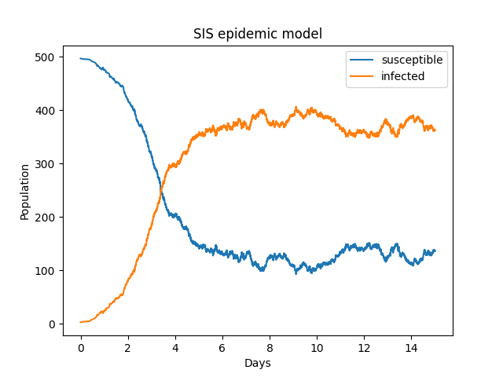
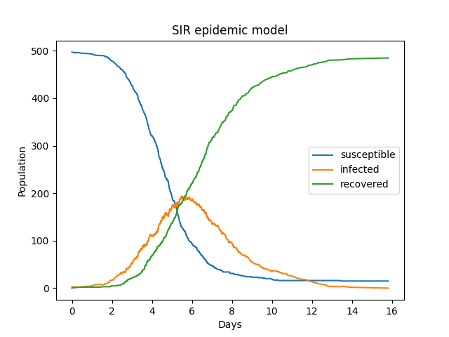
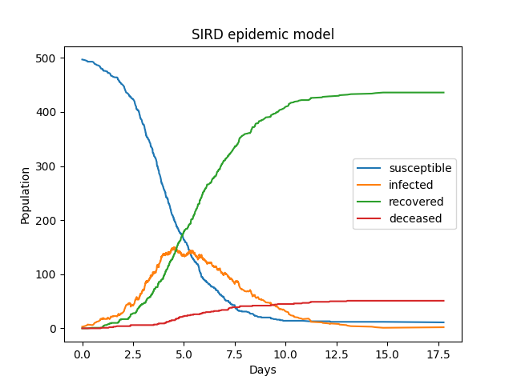

# Epidemics

Compartmental models simplify the mathematical modelling of infectious diseases.

Major assumptions are:
- Whole population N stays constant
- Transition rates stay constant
- Only given states/groups are allowed
- Only given transitions between those are allowed

## SIS

Susceptible people can get infected again after they are cured.

States:

```
S <-> I
```



## SIR

After being cured the infected transition into the recovered (removed) group and can't be infected again.

States:

```
S -> I -> R
```



## SIRD

This models the same behavior as SIR but differentiates between recoveries and deaths.

States:

```
       -> R
S -> I
       -> D
```



## SEIR

This models the same behavior as SIR but newly infected people first get exposed before they get contagious.

States:

```
S -> E -> I -> R
```


